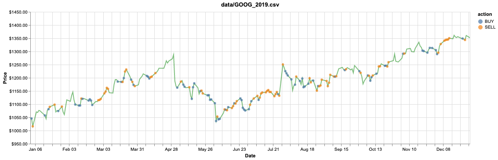

# Overview

This project implements a Stock Trading Bot, trained using Deep Reinforcement Learning, specifically Deep Q-learning. Implementation is kept simple and as close as possible to the algorithm discussed in the paper, for learning purposes.

## Introduction

Generally, Reinforcement Learning is a family of machine learning techniques that allow us to create intelligent agents that learn from the environment by interacting with it, as they learn an optimal policy by trial and error. This is especially useful in many real world tasks where supervised learning might not be the best approach due to various reasons like nature of task itself, lack of appropriate labelled data, etc.

The important idea here is that this technique can be applied to any real world task that can be described loosely as a Markovian process.

## Approach

This work uses a Model-free Reinforcement Learning technique called Deep Q-Learning (neural variant of Q-Learning).
At any given time (episode), an agent abserves it's current state (n-day window stock price representation), selects and performs an action (buy/sell/hold), observes a subsequent state, receives some reward signal (difference in portfolio position) and lastly adjusts it's parameters based on the gradient of the loss computed.

There have been several improvements to the Q-learning algorithm over the years, and a few have been implemented in this project:

- [x] Vanilla DQN
- [x] DQN with fixed target distribution
- [x] Double DQN
- [ ] Prioritized Experience Replay
- [ ] Dueling Network Architectures

## Results

Trained on `GOOG` 2010-17 stock data, tested on 2019 with a profit of $1141.45 (validated on 2018 with profit of $863.41):



You can obtain similar visualizations of your model evaluations using the [notebook](./visualize.ipynb) provided.

## Some Caveats

- At any given state, the agent can only decide to buy/sell one stock at a time. This is done to keep things as simple as possible as the problem of deciding how much stock to buy/sell is one of portfolio redistribution.
- The n-day window feature representation is a vector of subsequent differences in Adjusted Closing price of the stock we're trading followed by a sigmoid operation, done in order to normalize the values to the range [0, 1].
- Training is prefferably done on CPU due to it's sequential manner, after each episode of trading we replay the experience (1 epoch over a small minibatch) and update model parameters.

## Data

You can download Historical Financial data from [Yahoo! Finance](https://ca.finance.yahoo.com/) for training, or even use some sample datasets already present under `data/`.

## Getting Started

In order to use this project, you'll need to install the required python packages:

```bash
pip3 install -r requirements.txt
```

Now you can open up a terminal and start training the agent:

```bash
python3 train.py data/GOOG.csv data/GOOG_2018.csv --strategy t-dqn
```

Once you're done training, run the evaluation script and let the agent make trading decisions:

```bash
python3 eval.py data/GOOG_2019.csv --model-name model_GOOG_50 --debug
```

Now you are all set up!

## Acknowledgements

- [@keon](https://github.com/keon) for [deep-q-learning](https://github.com/keon/deep-q-learning)
- [@edwardhdlu](https://github.com/edwardhdlu) for [q-trader](https://github.com/edwardhdlu/q-trader)

## References

- [Playing Atari with Deep Reinforcement Learning](https://arxiv.org/abs/1312.5602)
- [Human Level Control Through Deep Reinforcement Learning](https://deepmind.com/research/publications/human-level-control-through-deep-reinforcement-learning/)
- [Deep Reinforcement Learning with Double Q-Learning](https://arxiv.org/abs/1509.06461)
- [Prioritized Experience Replay](https://arxiv.org/abs/1511.05952)
- [Dueling Network Architectures for Deep Reinforcement Learning](https://arxiv.org/abs/1511.06581)


#!/usr/bin/env bash
set -euo pipefail

# === CONFIG - edit before running ===
PROJECT_DIR="$HOME/Documents/Trading Bot"
REMOTE="https://github.com/gmtechs/tradebot.git"
BRANCH="main"
AUTHOR_NAME="Emmanuel Esikumo"
AUTHOR_EMAIL="gmtechlabs10@gmail.com"
START_DATE="2019-01-01"
END_DATE="2024-12-31"
COMMIT_COUNT=120
EXTRA_COMMITS=8
# ===================================

# Sanity
if [ ! -d "$PROJECT_DIR" ]; then
  echo "Project folder not found: $PROJECT_DIR"
  exit 1
fi

echo "THIS WILL REPLACE remote branch '$BRANCH' at $REMOTE with entirely new history."
read -p "Are you absolutely sure? Type 'yes' to continue: " yn
if [ "$yn" != "yes" ]; then
  echo "Aborted."
  exit 0
fi

cd "$PROJECT_DIR"

# Remove any existing git metadata (completely fresh history)
rm -rf .git
git init
git config user.name "$AUTHOR_NAME"
git config user.email "$AUTHOR_EMAIL"

# Gather files to commit (exclude .git)
mapfile -t FILES < <(find . -type f -not -path "./.git/*" -not -name "$(basename $0)" -print | sed 's|^\./||')
if [ ${#FILES[@]} -eq 0 ]; then
  echo "No files found to commit in $PROJECT_DIR"
  exit 1
fi
TOTAL=${#FILES[@]}
echo "Found $TOTAL files."

# compute group size
GROUP_SIZE=$(( (TOTAL + COMMIT_COUNT - 1) / COMMIT_COUNT ))

# prepare date range in epoch
start_ts=$(date -d "$START_DATE" +%s)
end_ts=$(date -d "$END_DATE" +%s)
if [ "$end_ts" -le "$start_ts" ]; then
  echo "Invalid START_DATE/END_DATE range"
  exit 1
fi
range=$(( end_ts - start_ts ))

random_date() {
  # generate random offset and convert to ISO-8601 with UTC offset
  # use two RANDOMs to expand entropy
  r=$(( (RANDOM << 15) ^ RANDOM ))
  off=$(( r % range ))
  ts=$(( start_ts + off ))
  date -u -d "@$ts" +"%Y-%m-%dT%H:%M:%S +0000"
}

i=0
commit_no=0
while [ $i -lt $TOTAL ]; do
  commit_no=$(( commit_no + 1 ))
  end=$(( i + GROUP_SIZE ))
  [ $end -gt $TOTAL ] && end=$TOTAL

  # stage chunk
  for f in "${FILES[@]:i:end-i}"; do
    git add --force -- "$f"
  done

  DATE_STR="$(random_date)"
  GIT_AUTHOR_DATE="$DATE_STR" GIT_COMMITTER_DATE="$DATE_STR" \
    git commit -m "feat: import files (batch $commit_no/$COMMIT_COUNT)" --author="$AUTHOR_NAME <$AUTHOR_EMAIL>" || true

  echo "Committed batch $commit_no with date $DATE_STR (staged $((end-i)) files)"
  i=$end
done

# Extra tiny commits to simulate iterative work
for k in $(seq 1 $EXTRA_COMMITS); do
  if [ -f README.md ]; then
    echo "" >> README.md
    git add README.md
  else
    echo "meta $k" > .meta_$k
    git add .meta_$k
  fi
  DATE_STR="$(random_date)"
  GIT_AUTHOR_DATE="$DATE_STR" GIT_COMMITTER_DATE="$DATE_STR" \
    git commit -m "chore: tiny change $k" --author="$AUTHOR_NAME <$AUTHOR_EMAIL>" || true
  echo "Extra commit $k at $DATE_STR"
done

# Ensure branch name
git branch -M "$BRANCH"

# add remote and force push
git remote add origin "$REMOTE"
echo "Force pushing to $REMOTE branch $BRANCH (this will overwrite remote history)..."
git push --force --set-upstream origin "$BRANCH"

# Optional: delete remote tags & branches (uncomment if you want a full wipe)
# echo "Deleting all remote tags..."
# git ls-remote --tags origin | awk '{print $2}' | sed 's|refs/tags/||' | xargs -r -n1 git push --delete origin
# echo "Deleting other remote branches..."
# git ls-remote --heads origin | awk '{print $2}' | sed 's|refs/heads/||' | grep -v "^$BRANCH$" | xargs -r -n1 git push origin --delete

echo "Done. New history pushed to $REMOTE on branch $BRANCH."


